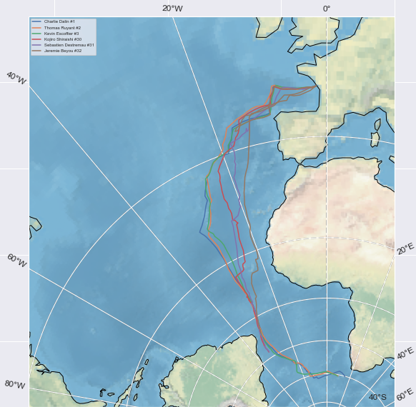

<p align="center">
  
</p>


# <p align="center"> Vendée Globe 2020-2021 </p>

_"Le Vendée Globe est à ce jour la plus grande course à la voile autour du monde, en solitaire, sans escale et sans assistance"_

__Objectifs principaux du projet__
- Extraction automatisée des informations techniques des bateaux
- Extraction automatisée des informations relatives aux données de classement
- Analyse des données de la course
- Visualisation des trajectoires des skippers
- Prédictions du classement des skippers

Toutes les données utilisées pour ce projet sont à disposition sur le site officiel de la course :
* https://www.vendeeglobe.org/fr/classement
* https://www.vendeeglobe.org/fr/glossaire

## Import des données

Les données de la course (classements, vitesses, positions, etc) comme les données techniques des voiliers sont scrapées sur le site officiel du Vendée Globe.
Pour cela, 2 fonctions distinctes sont implémentées

__Participants et fiches techniques des voiliers__

``` python
def get_info_boat_from_url(url):
    ''' Renvoie les informations techniques des bateaux ainsi que le nom des participants 
        dans un dictionnaire {Nom du bateau : {Skipper, {infos techniques}}'''
    
    r = requests.get(url)
    soup = BeautifulSoup(r.content, 'html.parser')
    info = {
        div_tag.find('h3', attrs={'class': 'boats-list__popup-title'}).text : {
            'Skipper' : div_tag.find('a').attrs['href'].split('/')[-1],
            'Boat info' : {
                li_tag.text.split(':')[0].strip() : li_tag.text.split(':')[1].strip()
                for li_tag in div_tag.findAll('li')}
        }
        for div_tag in soup.findAll('div', attrs={'class': 'boats-list__popup-infos'})
    }
    return info
```

__Classements, vitesses et positions__

``` python
def get_classement_from_url(url):
    ''' Renvoie les informations du classement de la course à une date donnée (la page url indique la date)
        dans un dictionnaire '''
    
    r = requests.get(url)
    soup = BeautifulSoup(r.content, 'html.parser')
    classement = {
        div_tag.find('li', attrs={'class': 'rankings__number'}).text.strip() : {
            'Skipper' : div_tag.find('p', attrs={'class': 'rankings__desc'}).text.strip().split('  ')[0],
            'Bateau' : div_tag.find('p', attrs={'class': 'rankings__desc'}).text.strip().split('  ')[-1],
            'Foil' : [1 if str(div_tag.find('svg', attrs={'class': 'icon-valid'})) != 'None' else 0][0],
            'Race data' : {
                second_list.text.strip().split('\n')[0] : second_list.text.strip().split('\n')[1:]
                for second_list in div_tag.find('ul', attrs={'class':'rankings__list m--second l-unlist'})\
                #.findAll('span', attrs={'class':'rankings__minititle desktop-hidden'})
                .findAll('li')
            }
        }
        for div_tag in soup.findAll('div', attrs={'class': 'rankings__item'})
    }
    return classement
```
## Visualisation des trajectoires des skippers

Sur la base des coordonnées (latitude et longitude) importées dans l'étape précédente, nous pouvons observer la trajectoire des skippers au fil des jours.


<table><tr>
<td>  </td>
<td>  </td>
</tr></table>

## Analyse des données

Il peut être intéressant d'étudier les impacts que pourraient avoir certaines caractéristiques techniques des voiliers sur les classements des skippers dans la course. 
De même, on peut également regarder l'évolution des distances parcourues par les skippers et leur vitesse moyenne dans la course.

__Corrélation VMG-position__

En croisant les informations techniques des bateaux et celles du classement, on peut dégager des intuitions à propos des éléments favorables ou défavorables aux participants de la course.
Ci-dessous, on regarde la position moyenne de chaque participant sur la durée totale de la course (depuis le 1er jour jusqu'aujourd'hui), et on y associe la VMG moyenne sur la même période.
_La VMG donne une indication entre la vitesse du bateau et l'angle du CAP. Un skipper qui voudra aller le plus rapidement d'un point A à un point B, devra trouver le meilleur compris entre l'angle de sa trajectoire pour rester au plus proche du vent, et sa vitesse en noeuds. Dans l'exemple ci-dessous, la VMG est maximisée pour une angle de 50°. Le bateau parcourt une distance plus grande, mais il a le compromis idéal entre distance et vitesse. Sa VMG est donc maximale (source https://www.orange-marine.com/content/474-bien-comprendre-le-principe-de-la-vmg-a-la-voile)._


Graphiquement, on constate une forte corrélation entre valeur élevée de VMG et bonne position dans le classement. Les participants qui ont le plus occupé les 1ères positions du classement, sont les participants dont les bateaux permettent une VMG la plus élevée.

Nous pouvons dès lors nous demander ce qui permet d'avoir une valeur de VMG élevée.
Quels sont les éléments techniques du bateau qui permettent de tels scores ? Est-ce dû à l'architecte du bateau, à la présence de foil, à la taille des voiles, etc ?

__Impact de la présence d'un foil__


Nous avions vu qu'une VMG élevée était corrélée à une meilleure position en moyenne dans le classement. Si on différencie désormais les participants dont le bateau est équipé d'un foil, de ceux dont le bateau ne l'est pas, on constate qu'il existe un avantage majeur à utiliser un foil. En effet, celui-ci permet d'augmenter en moyenne sa VMG, et on retrouve donc la corrélation entre VMG élevée et bon classement.

## Prédictions de classement

Sur la base des données techniques des voiliers et également grâce aux informations sur la course depuis son départ, on peut tenter de prédire un classement de la position des skippers dans les __5 jours__.


Au delà de cette estimation à quelques jours, on peut se risquer à un prédiction du classement final de la course (réalisée le 30 novembre 2020), en utilisant un modèle de __série temporelle__.

Ci dessous, l'estimation du __top 5__ en fin de course.


